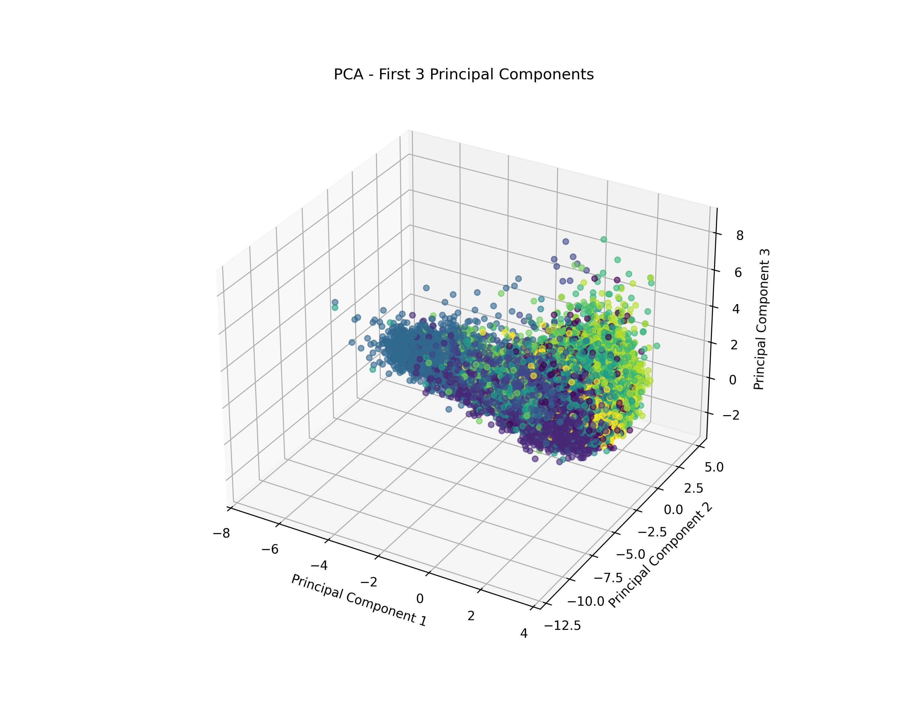
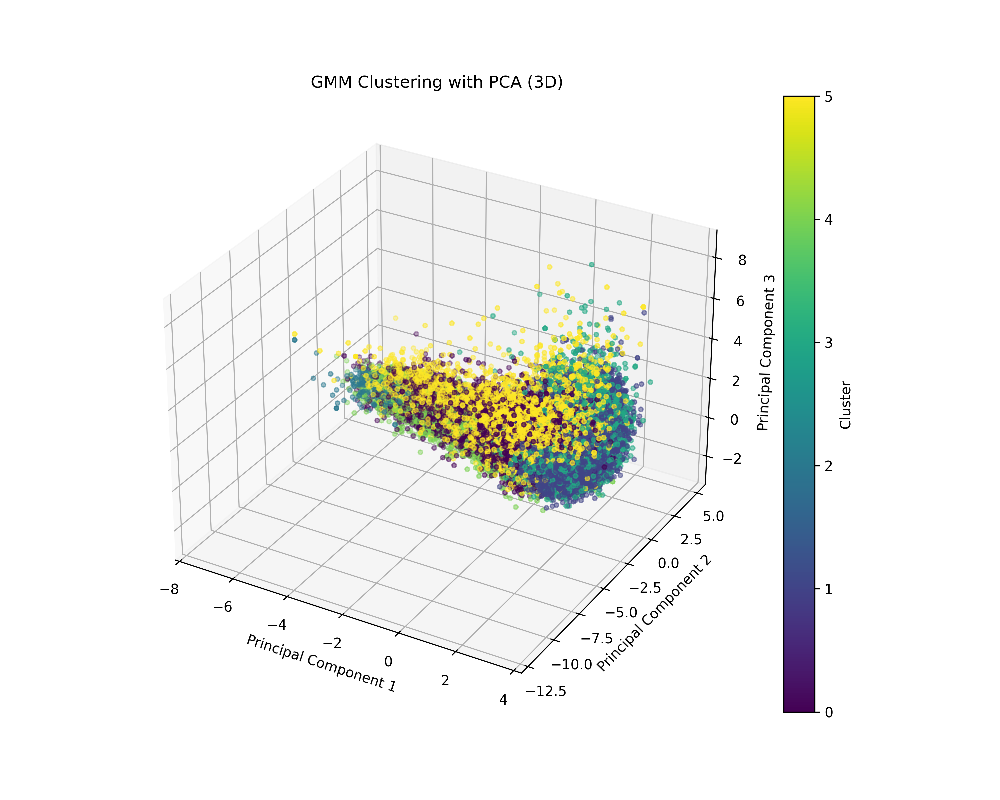
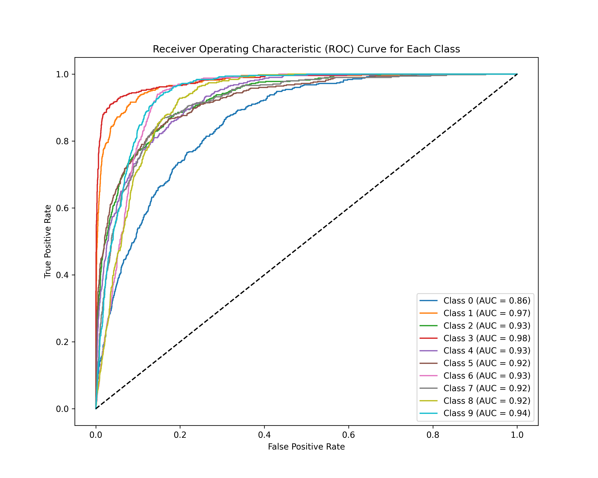

# Spotify Genre Classification
This project classifies music tracks into one of ten genres using various audio features from Spotify. The pipeline includes data preprocessing, dimensionality reduction using PCA, clustering via Gaussian Mixture Models (GMM), and classification using a deep neural network.

## Overview
- **Goal**: Predict the genre of a song using its numerical audio features
- **Dataset**: Cleaned Spotify audio dataset with features like tempo, energy, and danceability
- **Final Model**: Deep neural network with batch normalization and dropout
- **Performance**: AUC scores ranged from 0.86 to 0.98 across genres

## 🔧 Tools & Libraries
- Python, Pandas, NumPy
- Scikit-learn (PCA, GMM)
- TensorFlow / Keras (Neural networks)
- Matplotlib / Seaborn

## Data Preprocessing
- Missing values in `tempo` filled with the column mean
- Removed rows with other nulls (<1% of data)
- Encoded categorical variables (key, mode, genre) into numeric values
- Scaled continuous features using `StandardScaler`
- Applied PCA on the training set only (to prevent data leakage)

## Dimensionality Reduction & Clustering
- **PCA** retained 95% of variance and reduced noise
- **3D PCA Plot** showed overlapping genres

> *PCA Visualization*  
> 

- **GMM** clustering used BIC to determine optimal cluster count (6)
- GMM provided better separation than PCA, but still had overlapping clusters

> *GMM Cluster Plot*  
> 

## Neural Network Classification
- **Architecture**: 3 hidden layers with 256, 128, and 64 neurons
- Used `ReLU`, `BatchNormalization`, and `Dropout`
- Optimized with sparse categorical cross-entropy and early stopping

## Evaluation Metrics
- Evaluation metric: **AUC for each genre**
- ROC curves plotted to visualize classification performance

| Genre        | AUC  |
|--------------|------|
| Alternative  | 0.86 |
| Anime        | 0.97 |
| Blues        | 0.93 |
| Classical    | 0.98 |
| Country      | 0.93 |
| Electronic   | 0.92 |
| Hip-Hop      | 0.93 |
| Jazz         | 0.91 |
| Rap          | 0.92 |
| Rock         | 0.94 |

> *ROC Curve Example*  
> 

